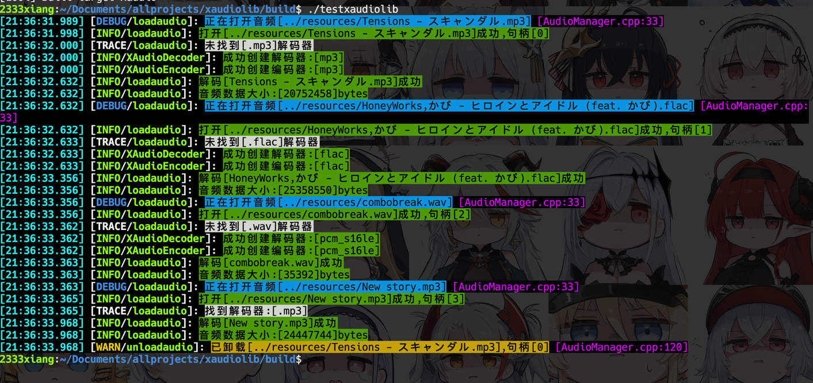

# xaudiolib (Xiang's Audio Library)

同练手项目,用学过的东西做一个能用的音频库

## 源码文件夹

-   api
    开放给用户的接口
-   config
    引擎配置

## 预计实现配置

| 功能           | 完成  |
|--------------|-----|
| 缓存 pcm(延迟最低) | [x] |
| 流式解码(延迟较高)   | [ ] |

-   engin
    内部实现
    -   codec 封装 ffmpeg 编解码器和平台底层编解码器等
    -   device 封装输入输出设备,使用 SDL2 实现
    -   mix 封装实现混音功能和变速等(变调与不变调两种实现)功能(不同实现算法)
    -   util 常用的工具静态函数
-   内部实现的引擎与音频管理器

-   logger xgl2d 的日志同源

### 缓存解码音频样例

