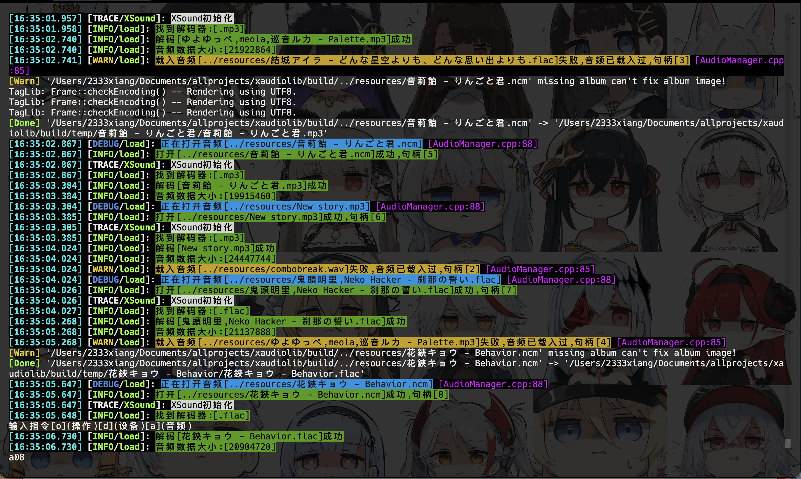
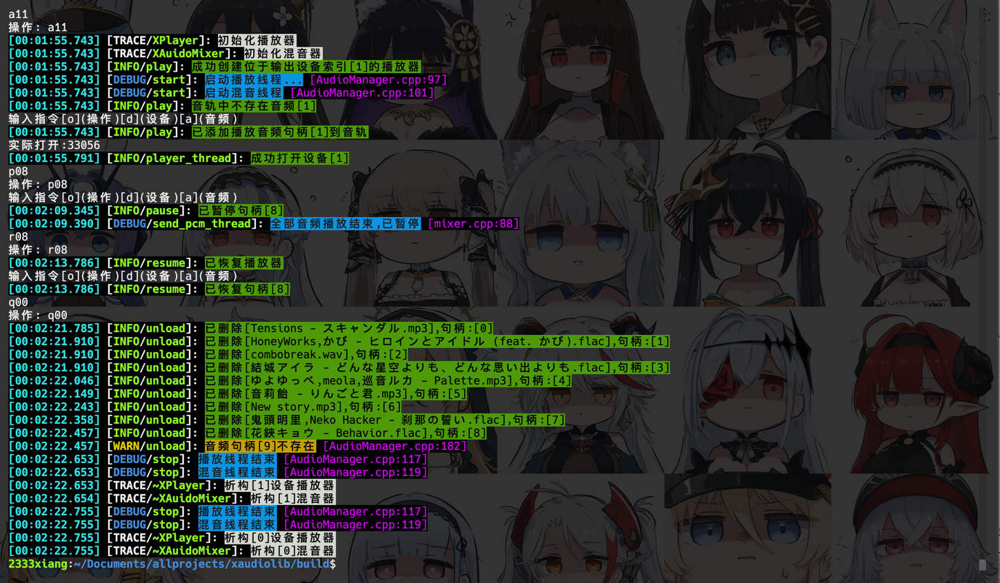
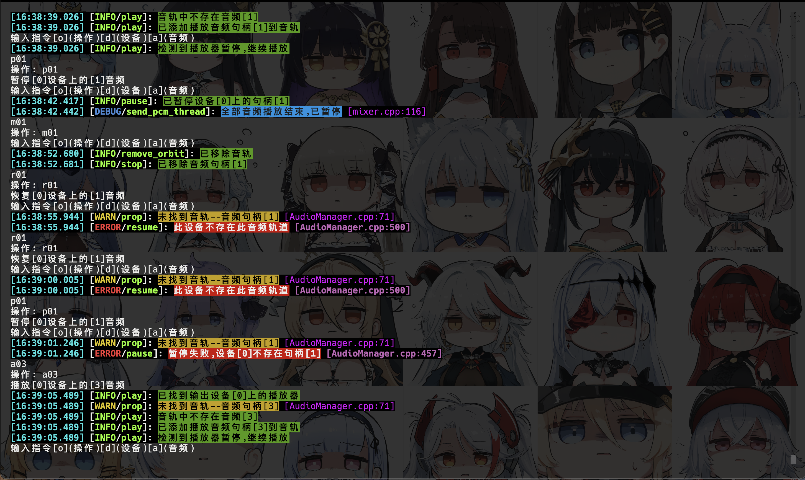
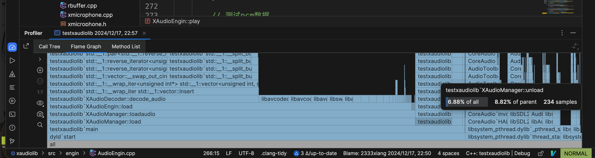

# xaudiolib (Xiang's Audio Library)

同练手项目,用学过的东西做一个能用的音频库

## 功能实现
|           功能            | 完成 |
|:-----------------------:|:--:|
|   缓存 pcm(内存 ⬆️ 延迟 ⬇️)   | ✅  |
|    流式解码(内存 ⬇️ 延迟 ⬆️)    |    |
|        解码网易云ncm         | ✅  |
|      根据音频名或音频句柄查询       | ✅  |
|      根据设备名或设备索引查询       | ✅  |
|      在指定设备播放和停止音频       | ✅  |
|      在指定设备暂停和恢复音频       | ✅  |
| 在指定设备启动和停止播放器(跟随播放音频自动) | ✅  |
|      在指定设备暂停和恢复播放器      | ✅  |
|          音频混合           | ⚡️ |

## 源码文件夹

-   api
    开放给用户的接口
-   config
    引擎配置
    ### 音频解码方式:
    - 缓存式解码
    - 流式解码
    ### 解码线程数:
    - 最大不可超过128
    ### 混音方式
    - CPU混音(可配置多线程,音频过多过长线程过多可能引起其他应用性能下降)
    - GPU混音-使用OpenCL API混音(性能很高,可调用GPU加速,速度取决于GPU性能)
    - GPU混音-使用OpenGL API混音(仅使用opengl的渲染管线进行并行计算)
    ### 混音缓冲区大小
    - 混音的环形采样缓冲区大小(至少为播放缓冲区的32倍(推荐64倍),否则可能引起音频减速)
    ### 音频通道
    - 解码音频时同步的音频通道数(将所有输入音频转化为此通道数)
    ### 采样率
    - 解码音频时同步的音频采样率(将所有输入音频转化为此采样率)
    ### 播放缓冲区
    - SDL音频回调的采样缓冲区大小(过低可能引起音频断断续续(推荐512))

-   engin
    内部实现
    -   codec 封装 ffmpeg 编解码器和平台底层编解码器等
    -   device 封装输入输出设备,使用 SDL2 实现
    -   mix 封装实现混音功能和变速等(变调与不变调两种实现)功能(不同实现算法)
    -   sdl 封装 sdl2 子音频库,实现播放器,播放环形缓冲区,麦克风
    -   util 常用的工具静态函数
-   内部实现的引擎与音频管理器
-   logger xgl2d 的日志同源

### 解码示例(支持解码ncm?[误,纯调用ncmdump命令行的])

### 播放示例(多设备同时播放不同音频并混音)

### 控制示例

### 性能(播放 30s 75%以上时间消耗在解码和卸载音频(缓存模式只解码一遍))

# 参考项目地址
https://github.com/taurusxin/ncmdump
